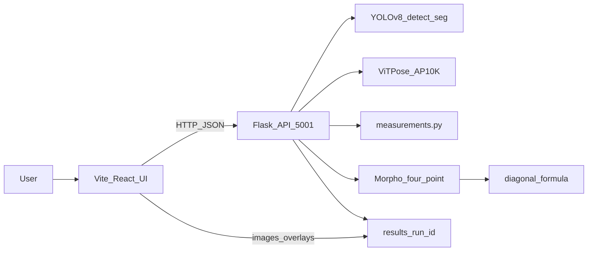

# Cattle Weight Detection System

Offline livestock cattle weight estimation from a **side-view photo**. A React (Vite) dashboard drives a local Flask API that runs YOLOv8 detection/segmentation, ViTPose (AP-10K) keypoints, body morphometrics, and weight prediction—without sending images to the cloud.

**Repository:** [SASagorAhmed/Livestock-Cattle-Weight-Estimation](https://github.com/SASagorAhmed/Livestock-Cattle-Weight-Estimation)

| Service | Default URL |
|---------|-------------|
| Frontend (Vite) | http://127.0.0.1:5173 |
| Backend API (Flask) | http://127.0.0.1:5001 |

---

## Features

- **Staged interactive pipeline** — upload → detect → select cow → pose → measure → segment → scale → features → predict → result
- **Multi-cow handling** — YOLO boxes; pick primary or alternate animal
- **17 AP-10K keypoints** via ViTPose ONNX (fully offline)
- **Shared body silhouette** — YOLO-seg mask (`segmentation_mask.png`) reused across Measure, Segment, and Morpho editors
- **Mask-aware measurement guides** — e.g. Back top / A End can snap to the silhouette while model feature keys stay consistent
- **Smartphone Diagonal Formula** (default) — four anatomical points + reference scale → weight in lb/kg
- **Optional modes** — heuristic baseline or measurement-model path when a trained pickle is available
- **Live Morpho editor** — drag four points; live A/B (px/cm) and formula preview
- **Run artifacts** stored under `frontend_dashboard/results/<run_id>/`
- **Vercel-ready UI** — frontend-only deploy; heavy models stay on a machine that can run Flask + ONNX

---

## Architecture



| Layer | Role |
|-------|------|
| `frontend_dashboard/frontend` | React UI, staged flow (`useDetectionFlow`), overlays, Morpho editor |
| `frontend_dashboard/backend` | Flask routes → `stages.py` / `pipeline.py` |
| `cow_pose_detection` | Detector, measurements, segmentation helpers |
| Models (Git LFS) | ONNX / PT / H5 weights under `cow_pose_detection/models/` and repo root |

---

## End-to-end pipeline

The UI walks these stages (labels match the progress strip):

| Stage | What happens |
|-------|----------------|
| **Upload** | JPG/PNG (or webcam). Options: enable segmentation, prediction mode (`smartphone_diagonal` / `heuristic` / `measurement`). Creates a `run_id`. |
| **Detect** | YOLOv8 finds cow bounding boxes. |
| **Select** | Choose which detection is the primary cow if several are present. |
| **Pose** | ViTPose AP-10K predicts **17 keypoints** (eyes, nose, neck, tail root, shoulders, elbows, hooves, hips, knees). Skeleton overlay + JSON. Often builds/refreshes the shared segmentation mask for later steps. |
| **Measure** | Pixel morphometrics from pose (`measurements.py`): body length, body height, torso diagonal, and related ratios. Guides such as Back top / A End can use the mask silhouette. |
| **Segment** | YOLO-seg body mask + red outline; anatomical region hints. Mask is shared with Morpho. |
| **Scale** | Reference length in the image (px) + real length (cm) → `cm_per_px`. Required for real-world units and the diagonal weight formula. |
| **Features** | Normalized ratios / feature vector prepared for the selected prediction path. |
| **Predict** | Weight estimate (see formulas below). |
| **Result** | Final report, overlays, downloads from the run folder. |

### Keypoints (AP-10K, 17)

| Index | Name | Index | Name |
|------:|------|------:|------|
| 0 | left_eye | 9 | right_elbow |
| 1 | right_eye | 10 | right_front_hoof |
| 2 | nose | 11 | left_hip |
| 3 | neck | 12 | left_knee |
| 4 | tail_root | 13 | left_back_hoof |
| 5 | left_shoulder | 14 | right_hip |
| 6 | left_elbow | 15 | right_knee |
| 7 | left_front_hoof | 16 | right_back_hoof |
| 8 | right_shoulder | | |

### Smartphone Diagonal Formula (default weight path)

Four points (editable in Morpho):

| Point | Anatomy |
|-------|---------|
| `A_start_lower_chest` | Lower chest |
| `A_end_withers` | Withers / back top |
| `B_start_tail_head` | Tail head |
| `B_end_shoulder_region` | Forward shoulder region |

With a valid scale (`cm_per_px`):

1. \(A\) = distance A_start → A_end (inches)  
2. \(B\) = distance B_start → B_end (inches)  
3. \(C = 2 \times A\)  
4. \(\mathrm{weight\_lb} = (C^{2} \times B) / 300\)  
5. \(\mathrm{weight\_kg} = \mathrm{weight\_lb} / 2.20462\)

Implemented in `frontend_dashboard/backend/diagonal_formula.py`. This path does **not** use `h5model.h5` or measurement pickle features.

### Other prediction modes

- **`heuristic`** — baseline heuristic weight from measurements when configured  
- **`measurement`** — uses a trained measurement model if a pickle/feature setup is present on disk  

---

## Models and assets (Git LFS)

Large files are stored with **Git LFS**. After clone, run `git lfs pull`.

| File | Purpose |
|------|---------|
| `cow_pose_detection/models/vitpose-b-ap10k.onnx` (+ `.onnx.data`) | ViTPose-Base AP-10K pose |
| `cow_pose_detection/models/yolov8s.onnx` | Cow / object detection boxes |
| `cow_pose_detection/models/yolov8n-seg.pt` | Instance segmentation mask |
| `h5model.h5` | Legacy / alternate weight network (not used by smartphone diagonal) |

### Required dependency (not in this repo)

Pose inference imports **easy_ViTPose**. Clone it once next to the detector:

```bash
git clone https://github.com/JunkyByte/easy_ViTPose.git cow_pose_detection/easy_ViTPose
```

---

## Repository layout

```text
Livestock-Cattle-Weight-Estimation/
├── frontend_dashboard/
│   ├── frontend/          # Vite + React UI
│   ├── backend/           # Flask API, stages, morpho, diagonal formula
│   ├── run_dashboard.py   # Starts API + frontend together
│   └── results/           # Per-run outputs (local; gitignored)
├── cow_pose_detection/
│   ├── detector.py        # YOLO + ViTPose
│   ├── measurements.py    # Morphometrics from keypoints
│   ├── segmentation.py    # YOLO-seg helpers
│   └── models/            # ONNX / PT weights (LFS)
├── githooks/              # commit-msg / pre-push hygiene
├── vercel.json            # Frontend-only Vercel build
├── command.md             # Short command cheat sheet
├── requirements.txt       # Python dependencies
└── README.md              # This file
```

---

## Requirements

- **Git** + **Git LFS**
- **Python 3** with a project virtualenv (`.venv` at repo root)
- **Node.js** + **npm** (frontend)
- Enough disk/RAM for ~780 MB of LFS models and ONNX Runtime / OpenCV

---

## Setup

```bash
git clone https://github.com/SASagorAhmed/Livestock-Cattle-Weight-Estimation.git
cd Livestock-Cattle-Weight-Estimation
git lfs pull

# Pose runtime dependency
git clone https://github.com/JunkyByte/easy_ViTPose.git cow_pose_detection/easy_ViTPose

# Python
python -m venv .venv
# Windows:
.venv\Scripts\activate
# Linux/macOS:
# source .venv/bin/activate
pip install -r requirements.txt

# Frontend
cd frontend_dashboard/frontend
npm install
cd ../..

# Optional: clean commit hooks for this clone
git config core.hooksPath githooks
```

More Windows/Git Bash variants: see [`command.md`](command.md).

---

## Run

### One-command (API + UI)

```bash
# activate .venv first
python frontend_dashboard/run_dashboard.py
```

Or on Windows: `frontend_dashboard\start_dashboard.bat`

### Manual (two terminals)

**Backend**

```bash
# repo root, venv active
python frontend_dashboard/backend/app.py
```

**Frontend**

```bash
cd frontend_dashboard/frontend
npm start
# same as: npm run dev
```

Open http://127.0.0.1:5173 — API at http://127.0.0.1:5001.

Flask does **not** auto-reload (`debug=False`). Restart the backend after Python changes (see `command.md` for freeing port 5001).

---

## Outputs

Each run writes under:

```text
frontend_dashboard/results/<run_id>/
```

Typical artifacts include the source image, pose overlays, measurement overlays, `segmentation_mask.png`, JSON reports, and prediction summary. Models under `cow_pose_detection/models/` are never modified by a run.

---

## Deploy (frontend only)

The Flask + YOLO/ViTPose stack is **not** suitable for Vercel serverless (model size and native deps). Deploy the **Vite UI** only:

1. Import this GitHub repo in [Vercel](https://vercel.com).
2. Use repository root (`vercel.json` build → `frontend_dashboard/frontend/dist`).
3. Set environment variable **`VITE_API_BASE`** to your public API base URL (no trailing slash), e.g. `https://your-api.example.com`.
4. Local default is `http://127.0.0.1:5001` (see `frontend_dashboard/frontend/.env.example`).

Host the Flask API separately (local machine, VM, or GPU box) and point the UI at it.

---

## Git conventions

- Default branch: **`master`**
- Owner remote: `https://github.com/SASagorAhmed/Livestock-Cattle-Weight-Estimation.git`
- After clone: `git config core.hooksPath githooks` so commit messages stay free of unwanted attribution trailers
- Do not commit: `.venv/`, `node_modules/`, `.cursor/`, `frontend_dashboard/results/`, `cow_pose_detection/easy_ViTPose/`

---

## CLI pose / measure (optional)

Without the dashboard, you can still run pose detection from `cow_pose_detection/`:

```bash
# venv active
python cow_pose_detection/detect_cow_pose.py --input path/to/cow.jpg
python cow_pose_detection/measure_cow.py --input path/to/keypoints.json
```

See [`cow_pose_detection/README.md`](cow_pose_detection/README.md) for flags and keypoint details.

---

## License / academic note

Weight estimates from the smartphone diagonal formula are **experimental**. Validate against scale weights before field or commercial use. Cite AP-10K / ViTPose / YOLO upstream projects as appropriate for your paper or report.
